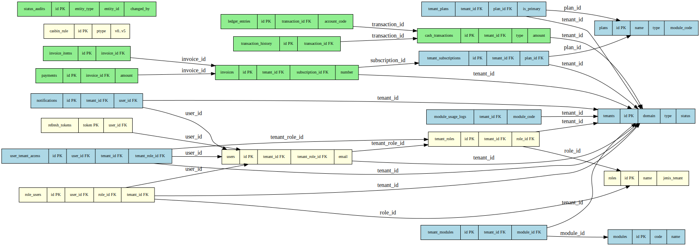

# Overview

## Purpose
Koperasi Digital Backend is a Go service powering a digital cooperative platform. It exposes HTTP APIs for modules such as billing, finance, membership and more.

## Architecture & Dependencies
The server entrypoint (`cmd/main.go`) loads configuration, opens a PostgreSQL database with GORM, initializes a Casbin enforcer for RBAC and wires up Fiber as the HTTP framework. Route registration is centralized in `internal/modules/registry.go`, which builds a base `/api` group. Tenant-specific subgroups exist under `/api/vendor`, `/api/koperasi`, `/api/bumdes`, and `/api/umkm`. The root `/api` group is split into a public subgroup with only a rate limiter and a secured subgroup that adds JWT authentication and Casbin RBAC. Vendor routes share JWT authentication, tenant isolation, Casbin RBAC and a rate limiter. Koperasi, Bumdes and UMKM groups apply the same stack plus a subscription guard. Background jobs run via a scheduler and object storage is provided through S3/MinIO drivers.

Key dependencies include Go 1.24, Fiber, GORM, PostgreSQL, Casbin, Viper, and Logrus.

## Key Internal Packages
- `config`: reads environment configuration using Viper.
- `database`: wraps GORM PostgreSQL connections.
- `middleware`: request logger, JWT auth, rate limiting, tenant context and more.
- `casbin`: constructs the RBAC enforcer backed by the database.
- `modules`: feature modules including analytics, asset, auth, authorization, billing, dashboard, finance, livechat, loan, membership, notification, RAT, reporting, risk, savings, sharia, SHU, tenant, ticket, and user.
- `scheduler`: cron-based background tasks (e.g. recurring invoices).
- `storage`: abstraction over S3 or MinIO object storage.
- `validator` & `response`: helpers for input validation and unified API responses.

Request flow: Fiber router → public or tenant-specific group middleware (logger, tenant context, JWT auth, tenant isolation, Casbin RBAC, rate limiter and subscription guard as needed) → module routes → handler → service → repository/database.

## Directory Layout
```
.
├── cmd/
├── configs/
├── docs/
│   ├── modules/
│   └── system/
├── internal/
│   ├── app/
│   ├── middleware/
│   ├── modules/
│   └── ...
├── migrations/
└── README.md
```

## Further Reading
- [Module Documentation](../modules/)
- [System Notes](../system/)

## Database Schema



The application uses a multi-tenant PostgreSQL schema. Most tables include a
`tenant_id` column so each tenant's data is kept separate. The key entities are:

### Authentication
- **users** – application accounts scoped to a tenant through `tenant_id` and a
  `tenant_role_id`.
- **roles** and **tenant_roles** – define permissions and assign them to specific
  tenants.
- **refresh_tokens** and **role_users** – support session management and RBAC.

### Tenant Management
- **tenants** – root record for each organization; links to plans and modules.
- **modules**, **tenant_modules** and **module_usage_logs** – control feature
  availability per tenant.
- **plans**, **tenant_plans** and **tenant_subscriptions** – describe billing
  plans and active subscriptions.

### Finance
- **invoices** and **invoice_items** – billing documents tied to a tenant and
  subscription.
- **payments** – records settlements against invoices.
- **cash_transactions**, **ledger_entries** and **transaction_history** – track
  financial movements and their audit trail.

These relationships are shown in the ER diagram above.
